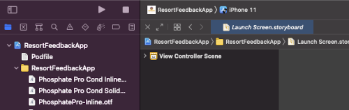
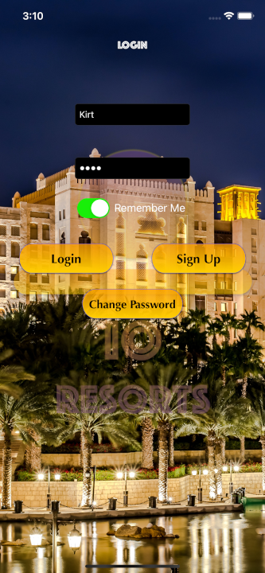
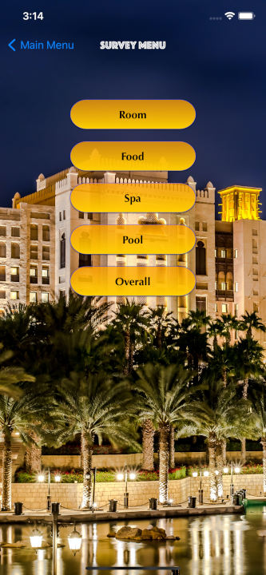

# Io Resorts

## Io Resorts Feedback App

This app allows users to sign up and leave feedback for a generic resort. The app stores all data persistanlty and allows users to save partially completed surveys and update their ratings after completion of the surveys. 

## Technologies Used

* Core Data
* UIKit
* Animation

## Features

* Persistantly stores user feedback
* Allows user to update feedback
* Each rating star plays different animations based on rating

To-do list:
* Refactor/reduce rating star code
* Add feature to show which surveys are partially completed

## Getting Started

Use  `git clone https://github.com/libgit2/libgit2` in an initialized git repository
Open `ResortFeedbackApp.xcworkspace` in the repository with XCode 12 or later

In the top right under ResortFeedbackApp scheme and then iPhone 11, then hit the play button or `CMD` + `R`/ `WINDOWS` + `R` on the keyboard

## Usage

This project can be used with minor updates to create and record user feedback using a 5 star system. 

## License

This project uses the following license: [MIT Licence](https://github.com/KirtlandRoss/Io-Resorts/blob/main/LICENSE).

